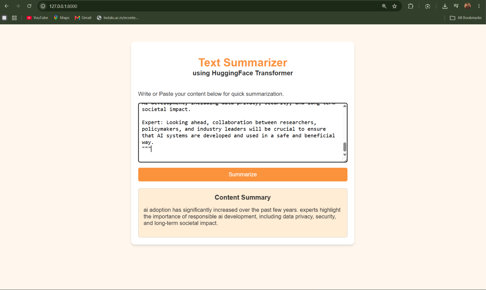

# 🤖 Text Summarizer App

An end-to-end **AI-powered Text Summarization Web Application** built using a fine-tuned **T5 Transformer model**, Hugging Face Transformers, and FastAPI.

The application accepts long text/dialogue from the user and generates a concise summary using a fine-tuned T5 model.

---

## 🖥️ Application Output

### Text Summarization Interface



The application provides a simple web interface where users can enter text and generate a summary.

---

## 🚀 Project Overview

This project demonstrates a complete **Deep Learning + NLP + Web Deployment** workflow:

```text
Dataset
   ↓
Data Pre-processing
   ↓
T5 Tokenization
   ↓
T5 Transformer Fine-Tuning
   ↓
Model Saving & Loading
   ↓
Text Summarization
   ↓
FastAPI Backend
   ↓
HTML + CSS + JavaScript Frontend
```

---

## ✨ Features

- 📝 Text/dialogue summarization
- 🤗 Hugging Face T5 Transformer
- 🧠 Fine-tuned Deep Learning model
- ⚡ FastAPI backend
- 🌐 HTML, CSS & JavaScript frontend
- 🔌 REST API for summarization
- 💾 Local trained model loading
- 📊 SAMSum dialogue summarization dataset

---

## 🛠️ Technologies Used

| Technology | Purpose |
|---|---|
| Python | Programming |
| PyTorch | Deep Learning framework |
| Hugging Face Transformers | T5 Transformer model |
| T5 | Text summarization |
| SAMSum | Training dataset |
| FastAPI | Backend/API |
| Uvicorn | ASGI server |
| HTML | Web structure |
| CSS | Web styling |
| JavaScript | Frontend/API communication |

---

## 📁 Project Structure

```text
Text-Summarizer/
│
├── app.py
├── index.html
├── output.png
├── README.md
├── requirements.txt
│
└── saved_summary_model/
    ├── config.json
    ├── model weights
    ├── tokenizer files
    └── other model files
```

> ⚠️ Large model-weight files may require Git LFS or a model-hosting service instead of regular GitHub file upload.

---

## ⚙️ Installation

### 1. Clone the repository

```bash
git clone https://github.com/YOUR_USERNAME/text-summarizer-t5-fastapi.git
```

```bash
cd text-summarizer-t5-fastapi
```

### 2. Install dependencies

```bash
pip install -r requirements.txt
```

---

## ▶️ Run the Application

Start the FastAPI server:

```bash
uvicorn app:app --reload
```

Open your browser:

```text
http://127.0.0.1:8000
```

---

## 🔌 API Endpoint

### POST `/summarize/`

Example request:

```json
{
  "dialogue": "Artificial intelligence is transforming many industries by enabling computers to perform tasks that normally require human intelligence."
}
```

Example response:

```json
{
  "summary": "Artificial intelligence is transforming many industries."
}
```

---

## 🧠 Model

The project uses a fine-tuned **T5 (Text-to-Text Transfer Transformer)** model for text summarization.

The model was trained using the **SAMSum dialogue summarization dataset** and saved locally for inference.

### Model workflow

```text
Input Text
    ↓
Tokenization
    ↓
T5 Transformer
    ↓
Text Generation
    ↓
Generated Summary
```

---

## 📚 What I Learned

Through this project, I implemented an end-to-end Deep Learning and NLP application:

- Dataset preprocessing
- T5 tokenization
- Transformer architecture
- Fine-tuning a pre-trained Transformer
- Model saving and loading
- Text summarization
- FastAPI backend development
- Client-server communication
- Frontend integration
- Local AI model deployment

---

## 🎯 Project Goal

The main goal of this project was to understand how a **pre-trained Transformer model can be fine-tuned and deployed as a real-world AI web application**.

---

## 👨‍💻 Author

### Aniket Kharose

**Electronics & Telecommunication Engineering**

Interests:
- Artificial Intelligence & Machine Learning
- Deep Learning
- Embedded Systems
- Communication Engineering


⭐ If you find this project useful, consider giving it a star!
